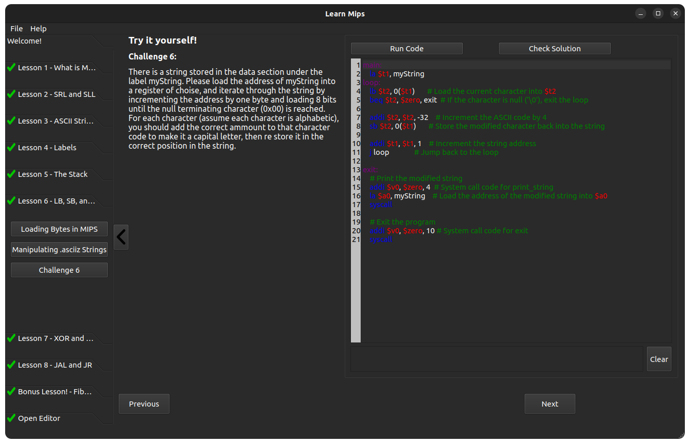

# LearnMips

### Description

LearnMips is a Desktop app written in Qt that aims to teach beginner programmers how to program with the MIPS architecture instruction set.

The application features a set of incrementally harder programming challenges meant to introduce each instruction and idea in MIPS, where the answers to the questions are checked using a MIPS emulator.

### Challenges

1. Add instructions and MIPS introduction.
2. SRL and SLL instructions.
3. Storing strings on the stack.
4. Labels and jumps.
5. Loads and stores.
6. Addresses and string manipulation.
7. XOR with one time pad encryption.
8. JAL/JR and calling conventions.
9. Bonus challenge: nth Fibonacci sequence.

## Supported instructions

1. addi add
2. subi sub
3. xori xor
4. sll srl
5. lw sw
6. lb sb
7. la
8. beq, bne, blt, bgt
9. j jal jr

### syscalls
1. Print Integer
2. Print String
3. Print Char
3. Exit

### Misc Supported Syntax
1. .data 
2. .text
3. labels
2. ascii labels

## Usage and Installation

Clone repo, then build with qmake and run.
Further instructions for how to use the app are on the welcome screen, and the application saves files to where it is ran from to save and load progress.

## ScreenShots
